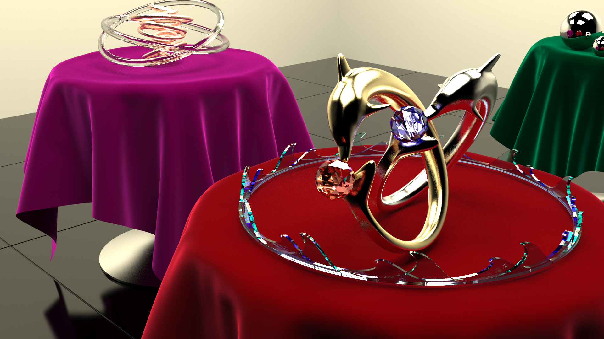

## Moody Render for rtcamp6

## スライド
https://speakerdeck.com/ushiostarfish/moody-render

## 構成
BasicPTでメイン開発しつつ、Renderで提出します。
ほかは多目的な検証やらなんやらです。

## シーン
houdiniのファイルからレンダリング可能な、シーン全体のalembicを書き出すためには、Indie以上が必要です。
そのため、最終シーンはこちらからDL可能にしました。 
https://s3-ap-northeast-1.amazonaws.com/ushiobucket1/rtcamp6/cornelbox.zip  
これをdata以下のフォルダに配置します

## 依存
openframeworks 0.10.0

embree 3.1.0

https://embree.github.io/

because 3.2 have libmmd.dll dependancy reported at https://github.com/embree/embree/issues/195

vcpkg
alembic:x64-windows
tbb:x64-windows

